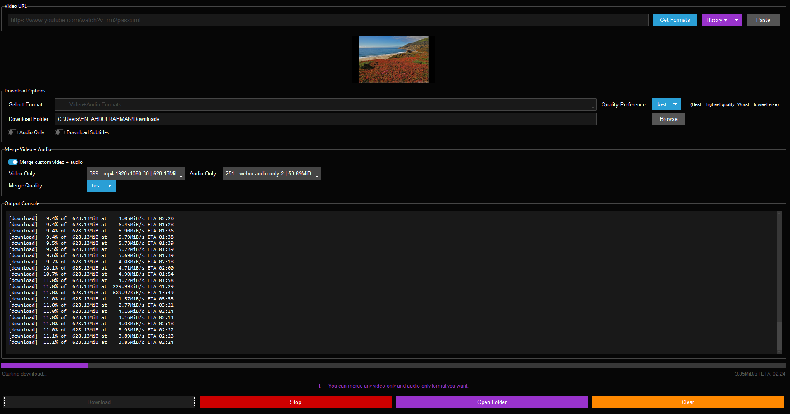

# Video Downloader



## Overview
The Video Downloader is a Python application that allows users to download videos from various supported websites. It provides a user-friendly interface built with Tkinter and supports multiple formats and quality preferences.

## Features
- Download videos from popular sites like YouTube, Facebook, Instagram, and more.
- Select video formats and quality preferences.
- Option to download audio only.
- Save download history and preferences.
- **Drag & Drop**: Drag URLs directly into the URL field.
- **Auto-paste Clipboard**: Automatically fills the URL field if a supported link is in your clipboard.
- **Detailed Progress**: See download percentage, speed, and ETA.
- **Tooltips**: Hover over buttons for quick help.
- **Clear History**: Easily clear your download history from the menu.

## Installation
1. Ensure you have Python installed on your machine.
2. Install the required dependencies:
   ```
   pip install -r requirements.txt
   ```
3. Make sure `yt-dlp` and `ffmpeg` are installed and accessible in your system's PATH.
   - For drag & drop, you may need to install `tkinterDnD2`:
     ```
     pip install tkinterdnd2
     ```

## Usage
1. Run the application:
   ```
   python py.py
   ```
2. Paste or drag the video URL into the input field (auto-paste from clipboard is supported).
3. Click "Get Formats" to see available download options.
4. Select your preferred format and click "Download" to start downloading.
5. Use the history menu to quickly access or clear previous URLs.

## Supported Sites
- YouTube
- Facebook
- Twitter
- Instagram
- TikTok
- Vimeo
- Dailymotion
- Twitch
- SoundCloud
- Reddit
- LinkedIn
- Tumblr

## License
This project is licensed under the MIT License. See the LICENSE file for details.